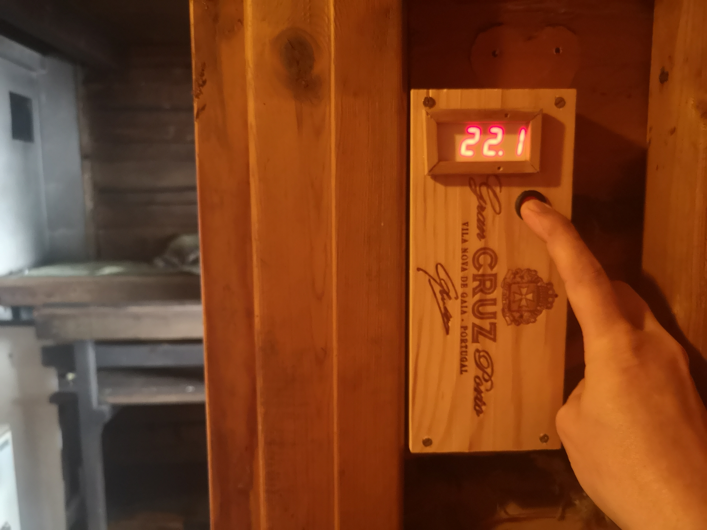

# Lämpötilanäyttö

Koodi hakee tugurium palvelimelta kahden sensorin arvot ja näyttää nämä 3 sekunnin välein. Näytön "conn" viesti tarkoittaa että MCU on ottamassa yhteyttä Wifi tukiasemaan ja "load" viesti että tietoa ollaan lataamassa serveriltä.

Laitteisto

- Lolin(Wemos) D1 mini pro, ESP8266
- TM1637 4-digit display
- 4x1,5v AA batteries

Wiring:

- 6v to MCU 5v
- GND to MCU GND and TM1637 GND
- MCU 3v to TM1637 VCC
- MCU D7 to TM1637 CLK
- MCU D6 to TM1637 DIO

